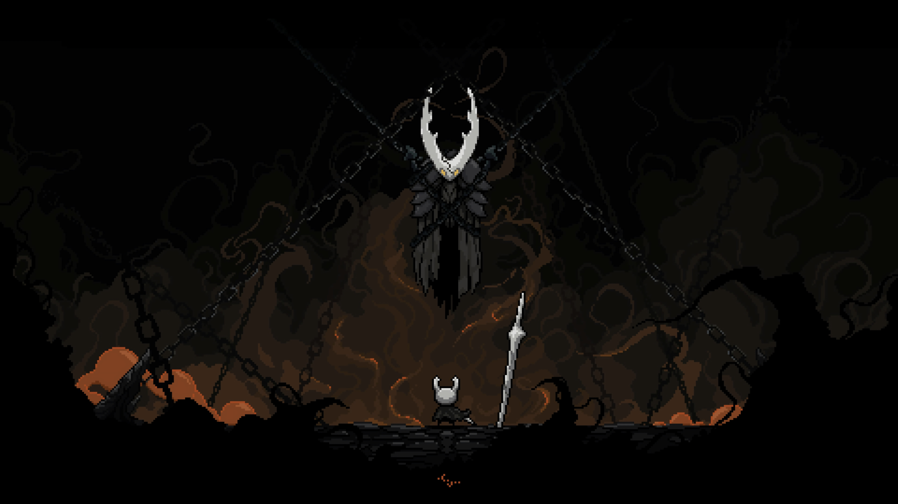

# Hollow Knight GRUB Theme

A dark, atmospheric GRUB2 bootloader theme inspired by the game Hollow Knight. Features clean typography, cyan highlights, and comprehensive OS icon support.



## Features

- **Dark aesthetic** with Hollow Knight-themed background artwork
- **Modern design** with cyan (#02CCFC) selection highlights
- **80+ OS icons** supporting major Linux distributions, BSD, Windows, and macOS
- **Clean typography** using Terminus and DejaVu Sans fonts
- **Helpful keyboard shortcuts** displayed on screen
- **Progress bar** with timeout notifications
- **Responsive layout** optimized for various screen resolutions

## Supported Operating Systems

The theme includes icons for:
- **Linux**: Arch, Ubuntu, Fedora, Debian, Manjaro, Pop!_OS, Linux Mint, Gentoo, openSUSE, and many more
- **BSD**: FreeBSD, Haiku
- **Other**: Windows, macOS, Android
- **Special**: Recovery mode, EFI, shutdown, restart

## Installation

### Automatic Installation (Recommended)

```bash
sudo ./install.sh
```

The script will:
- Backup your existing GRUB theme (if any)
- Copy theme files to `/boot/grub/themes/hollow-knight/`
- Update GRUB configuration
- Regenerate GRUB menu

### Manual Installation

1. **Copy theme files:**
   ```bash
   sudo mkdir -p /boot/grub/themes/hollow-knight
   sudo cp -r * /boot/grub/themes/hollow-knight/
   ```

2. **Edit GRUB configuration:**
   ```bash
   sudo nano /etc/default/grub
   ```
   
   Add or modify these lines:
   ```
   GRUB_THEME="/boot/grub/themes/hollow-knight/theme.txt"
   GRUB_GFXMODE=1920x1080
   ```

3. **Update GRUB:**
   
   For Debian/Ubuntu/Mint:
   ```bash
   sudo update-grub
   ```
   
   For Arch/Manjaro:
   ```bash
   sudo grub-mkconfig -o /boot/grub/grub.cfg
   ```
   
   For Fedora/RHEL:
   ```bash
   sudo grub2-mkconfig -o /boot/grub2/grub.cfg
   ```

4. **Reboot to see changes:**
   ```bash
   reboot
   ```

## Customization

### Change Title Text

Edit `theme.txt` and uncomment/modify line 20:
```
#text = "BTW its Arch"
```

### Adjust Colors

Key color definitions in `theme.txt`:
- `selected_item_color = "#02CCFC"` - Highlight color (cyan)
- `item_color = "#cccccc"` - Default menu item color
- `desktop-color = "#000000"` - Background color

### Change Background

Replace `background.png` with your own image (recommended: 1920x1080 or higher).

### Font Sizes

Available fonts:
- Terminus: 12, 14, 16, 18 (regular and bold)
- DejaVu Sans: 12, 14, 16, 24, 48

Modify font references in `theme.txt` to adjust text sizes.


## Troubleshooting

### Theme doesn't appear after installation
- Verify GRUB_THEME path in `/etc/default/grub`
- Ensure theme files have correct permissions: `sudo chmod -R 755 /boot/grub/themes/hollow-knight`
- Check GRUB config was regenerated: `sudo update-grub` or `sudo grub-mkconfig`

### Low resolution / Blurry theme
- Set appropriate resolution in `/etc/default/grub`:
  ```
  GRUB_GFXMODE=1920x1080
  GRUB_GFXPAYLOAD_LINUX=keep
  ```
- Regenerate GRUB config after changes

### Icons not showing
- Ensure icon files are in `/boot/grub/themes/hollow-knight/icons/`
- GRUB matches icons by OS name patterns in menu entries
- Check icon file names match GRUB's expected naming conventions

### Custom OS not showing correct icon
- Add a custom icon as `icons/your-os-name.png` (32x32 PNG)
- GRUB matches based on menu entry text

## Uninstallation

### Using uninstall script
```bash
sudo ./uninstall.sh
```

### Manual uninstallation
1. Edit `/etc/default/grub` and remove/comment the `GRUB_THEME` line
2. Regenerate GRUB: `sudo update-grub` or `sudo grub-mkconfig`
3. Optionally remove theme files: `sudo rm -rf /boot/grub/themes/hollow-knight`

## Credits

- **Artwork**: Hollow Knight characters and assets © Team Cherry
- **Theme Design**: Custom GRUB2 theme configuration
- **Fonts**: Terminus, DejaVu Sans (open source)
- **Icons**: Community-sourced distribution logos

## License

This theme is provided as-is for personal use. Hollow Knight artwork and characters are property of Team Cherry. Distribution logos are trademarks of their respective owners.

## Contributing

Improvements welcome! Areas for contribution:
- Icon quality improvements
- Additional OS icons
- Layout optimizations
- Resolution adaptability
- Bug fixes

## Screenshots

The theme features:
- Centered boot menu with 70% width
- Cyan selection highlight
- Bottom-aligned help text with keyboard shortcuts
- Timeout progress bar
- Dark, atmospheric background

---

**Note**: This is a bootloader theme. Always maintain backups and test in a safe environment before deploying on critical systems.
